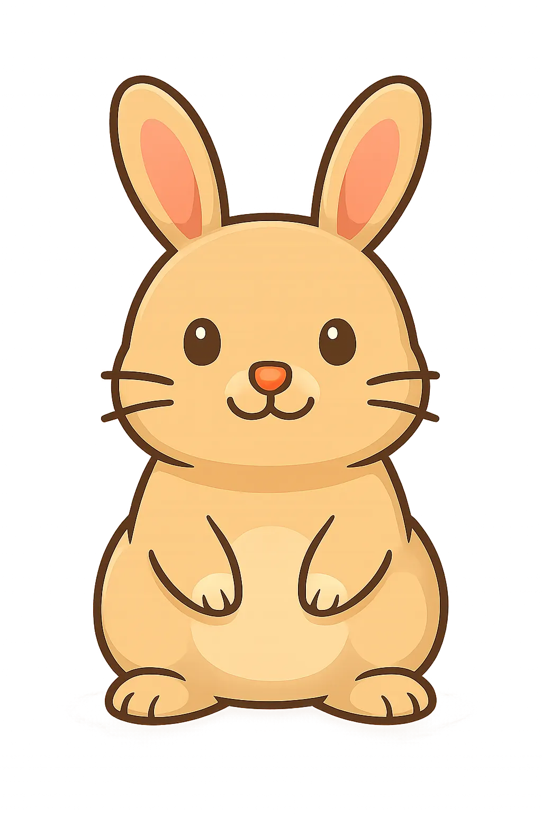

# 🕳️ Clone Game


---

## 🎮 Overview

**CritterHoles on Celo** is a blockchain-based casual game built on **Celo Mainnet**, where players whack critters, earn points, and claim on-chain rewards.  
The game uses **React + TypeScript + Vite** with **Reown AppKit**, **wagmi**, and a Cloudflare backend for claim verification.

---

## 🧩 Gameplay

### 🎯 Objective
- Hit critters as they pop up before time runs out.
- Each critter type gives different scores based on rarity:

| Critter | Image | Points | Rarity |
|----------|--------|---------|---------|
| 🐹 Mole |  | 1 | Common |
| 🦨 Skunk |  | 2 | Uncommon |
| 🐇 Rabbit |  | 3 | Rare |

### 🪓 Requirement
You must own a **Hammer NFT** to play. Mint one on the **Mint Page** using the `mint()` function in the Celo contract.

### 💰 Rewards
- After the game ends, scores are converted into `$CHP` tokens.
- Random rewards include `$ETHIX` or `$GoodDollar`.
- Players have a **daily claim limit**, read from the contract.
- Claims are verified through a Cloudflare Function at `/api/claim`.

---

## 🪙 Game Economy

- `$CHP` — main in-game point token.  
- `$ETHIX` and `$GoodDollar` — bonus tokens randomly distributed.  
- Smart contracts are managed in the [Hardhat repository](https://github.com/hihenluo/hardhat).

---

## ⚙️ Architecture

| Layer | Description |
|-------|--------------|
| **Frontend** | React 19 + TypeScript + Vite 7 |
| **Blockchain** | Celo Mainnet |
| **Wallet Integration** | Reown AppKit + wagmi + viem |
| **Backend** | Cloudflare Functions (`/functions/claim.ts`) |
| **UI Framework** | TailwindCSS + Framer Motion |
| **MiniApp** | Farcaster integration |

---

## 🧑‍💻 Setup & Development

### 1️⃣ Clone the Repository

```bash
git clone https://github.com/hihenluo/Critterholes.git
cd Critterholes
```

### 2️⃣ Install Dependencies

```bash
npm install
```

### 3️⃣ Environment Variables

In the `functions/` directory, create an `.env` file:

```bash
SIGNER_PRIVATE_KEY=your_private_key
ETHIX_TOKEN_ADDRESS=your_ethix_token_address
G_TOKEN_ADDRESS=your_gooddollar_token_address
CELO_RPC_URL=https://forno.celo.org
```

> These variables are used by the Cloudflare Function `/api/claim` to sign reward claims and interact with Celo smart contracts.

---

## 🚀 Run the Game

### Start Development Server
```bash
npm run dev
```

### Build for Production
```bash
npm run build
```

### Preview Production Build
```bash
npm run preview
```

---

## ☁️ Cloudflare Function

### `/functions/claim.ts`

Handles reward claiming logic:
- Validates connected wallet and score.
- Generates and returns claim signature (`v`, `r`, `s`, `databytes`).
- Interacts with Celo contracts to confirm reward eligibility.

Deploy to Cloudflare with:

```bash
npx wrangler deploy
```

---

## 🧠 Game Flow Summary

1. Player connects wallet using Reown.  
2. System checks Hammer NFT ownership.  
3. If missing, mint one before playing.  
4. During the game, player earns points.  
5. After game ends, claim reward via `/api/claim`.  
6. Backend signs transaction and executes `claim()` on-chain.  

---

## 🔗 Useful Links

- 🎮 [Main Game Repo](https://github.com/hihenluo/Critterholes-on-Celo)
- 💻 [Smart Contract Repo (Hardhat)](https://github.com/hihenluo/hardhat)
- 💚 [Celo Network](https://celo.org/)
- 🔐 [Reown AppKit](https://reown.io/)
- 🌐 [Cloudflare Pages](https://developers.cloudflare.com/pages/)

---

## 📜 License

Licensed under the [MIT License](https://github.com/hihenluo/Critterholes-on-Celo/blob/main/LICENSE.md)

---

### 💫 Built with ❤️ by the CritterHoles Team  
_on Celo Mainnet • Powered by Reown & Farcaster_
